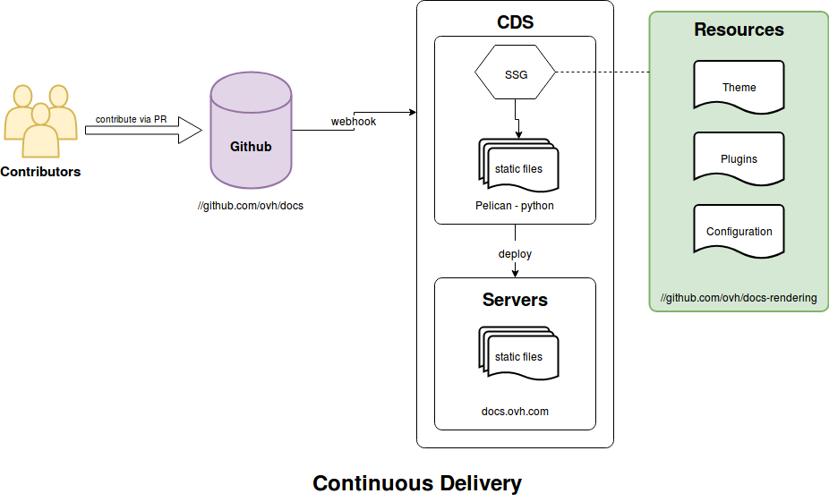
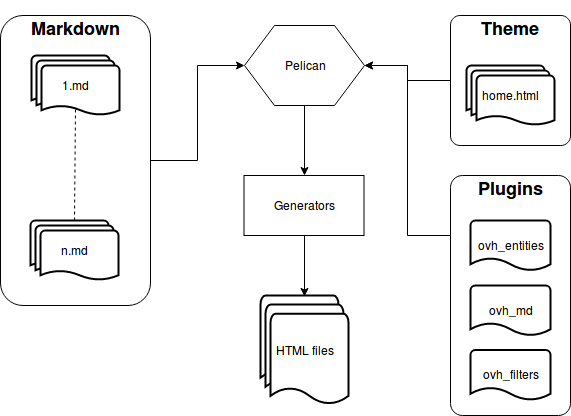
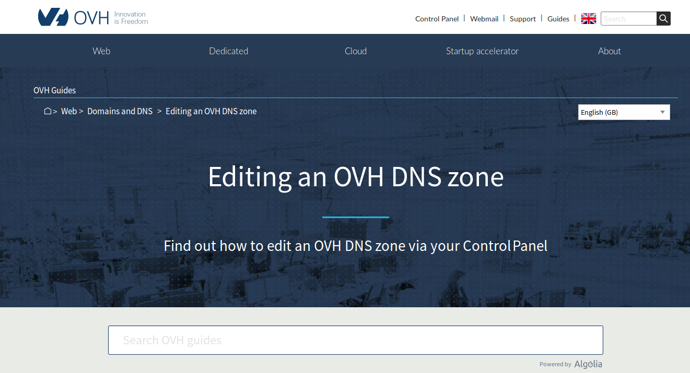
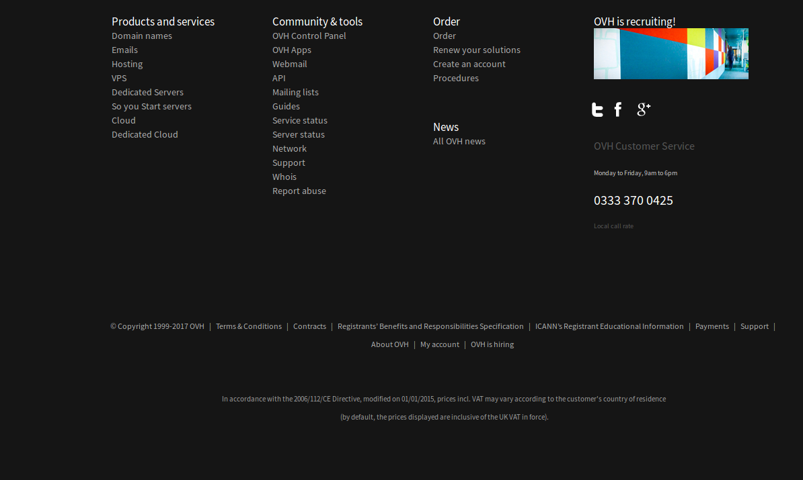
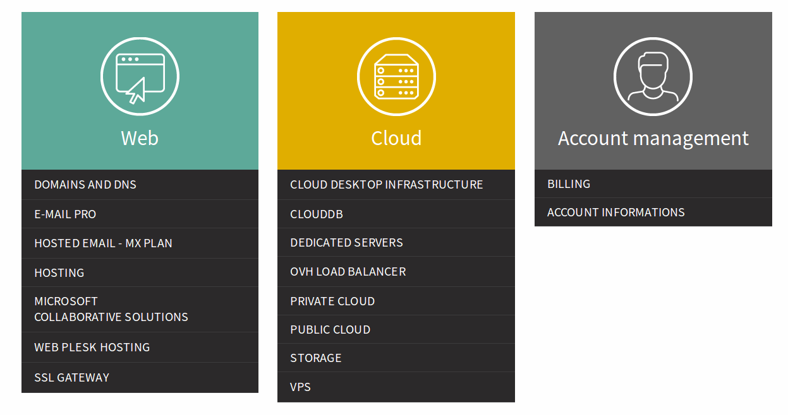
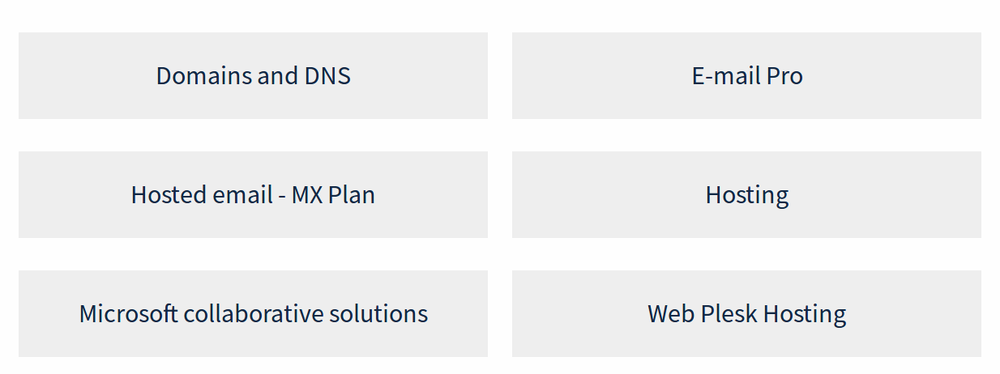
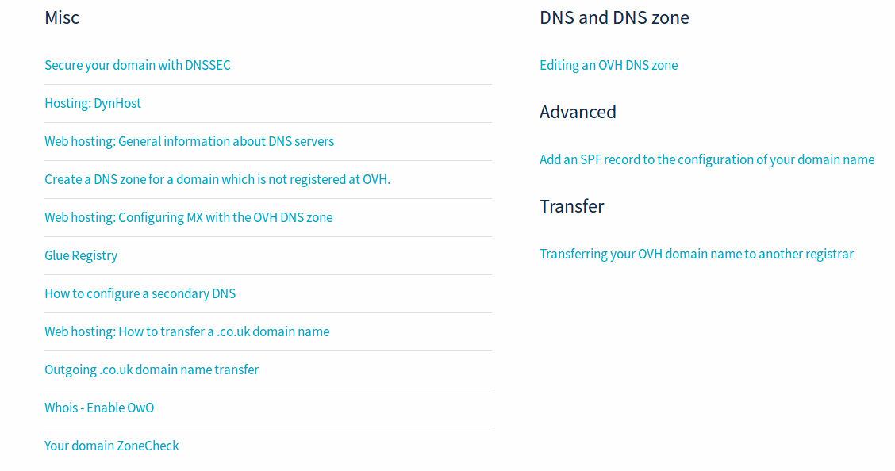
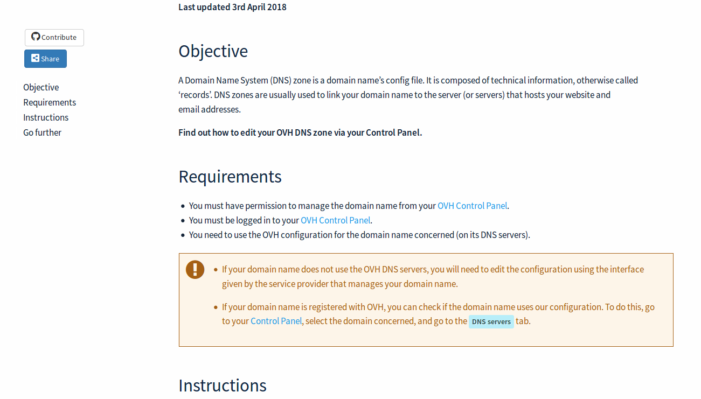

# OVH - Docs rendering engine
This repository contains our official Documentation Rendering Engine.

## Continuous integration
Based on flat markdown content from [Github OVH.Docs](https://github.com/ovh/docs), we build docs.ovh.com and template all markdown with our rendering engine. Our build contains a bunch of static HTML files, deployed in ours front webfarms.

Our CI Pipe is managed by [CDS](https://github.com/ovh/cds)
All modifications to this repository, will automatically trigger a new build to docs.ovh.com.

## Test it

Clone the repository
```sh
git clone --recurse-submodules https://github.com/ovh/docs-rendering.git
```

Go to the project root
```sh
cd docs-rendering
```

Build the docker image
```sh
./docker/build.sh
```

> This build the docker image using the current user's ID and group ID.

> The resulting image name is `ovh-docs-dev-env`

Run the container with the helper script:
```sh
./docker/run-container.sh [-f /path/to/docs] [-p port]
```

You can find a more details in the [getting-started](getting-started.md) guide.

## Technical specs

[docs.ovh.com](https://docs.ovh.com/) is entirely generated with [Pelican](https://github.com/getpelican/pelican) from `markdown` [files](https://github.com/ovh/docs)

In this repository, you will find all configurations, themes and plugins that we use in the context of the continuous delivery of [docs.ovh.com](https://docs.ovh.com/) illustrated in the diagram below (`green` part).



### Pelican

Description from the Pelican repository:
> [Pelican](https://github.com/getpelican/pelican) is a static site generator, written in Python
>
>    - Write content in Markdown using your editor of choice
>    - Includes a simple command line tool to (re)generate site files
>    - Easy to interface with version control systems and web hooks
>    - Completely static output is simple to host anywhere

The choice of Pelican was done for its great extensible capabilities.

1. We could easily create plugins that manage our hierachical files structure:
    - for custom url generation.
    - for entity linking.
2. We took advantage of the python's awesome and extensible implementation of markdown for handling
our custom content.
3. We could in a next step, quickly change the look of the site thanks to a theme powered by jinja2 template.



### Plugins

#### OVH Entities (`plugins/ovh_entities`)
extends [`pelican-entities`](https://github.com/AlexJF/pelican-entities) in order to suit our needs.

##### Entity matching

Because of our docs repository is structured in a hierarchical manner, we needed to easily define search path for entity using regexp instead of just a folder name.

More info about entity naming and hierarchy can be found [here](https://github.com/ovh/docs/blob/master/docs-guideline/docs-guideline.md)

```
# repository stucture example
.
├── pages
|   ├── web
|   |   ├── domains
|   |   |   ├── glue-registry
|   |   |   |   ├── guide.en-gb.md (title: Glue Registry)
|   |   |   |   └── guide.fr-fr.md (title: Activer le Glue Registry sur son domaine)
|   |   |   ├── product.en-gb.md (title: Domains and DNS)
|   |   |   └── product.fr-fr.md (title: Domaines et DNS)
|   |   ├── hosting
|   |   |   ├── 24-days
|   |   |   |   ├── day01
|   |   |   |   |   └── guide.fr-fr.md (title: Les bases des sites web)
|   |   |   |   ├── day02
|   |   |   |   |   └── guide.fr-fr.md (title: Choisir et configurer un nom de domaine)
|   |   |   |   └── guide.fr-fr.md (title: Développer votre projet pas à pas avec l'hébergement web OVH)
|   |   |   ├── product.en-gb.md (title: Domains and DNS)
|   |   |   └── product.fr-fr.md (title: Domaines et DNS)
|   |   ├── universe.en-gb.md (title: Web)
|   |   └── universe.fr-fr.md (title: Web)
|   ├── home.en-gb.md (title: OVH - Documentation)
|   └── home.fr-fr.md (title: OVH - Guides)
└── README.md
```

```py
# entities search path regexp configuration in pelicanconf.py
ENTITY_TYPES = {
    "Home": {
        "PATHS": ["home.*.md"],
    },
    "Universe": {
        "PATHS": ["**/universe.*.md"],
    },
    "Product": {
        "PATHS": ["**/product.*.md"],
    },
    "Guide": {
        "PATHS": ["**/guide.*.md"],
    },
}
```

##### Entity children
When needed, for each entity, we add a children property that lists all authorized children (useful in jinja2 templates for children list rendering).

```py
# entities children configuration in pelicanconf.py
ENTITY_TYPES = {
    "Home": {
        "CHILDREN": ["Universe"],
    },
    "Universe": {
        "CHILDREN": ["Universe", "Product"],
    },
    "Product": {
        "CHILDREN": ["Guide"],
    },
    "Guide": {
        "CHILDREN": ["Guide"],
    },
}
```

##### url building
We needed to exclude some part of the default generated url by pelican without the need to include
the `override_url` and `override_save_as` properties in each file.

Those properties are generated for each entity using the config property `EXCLUDE_SLUGS`.

```py
# entities slug exclusion configuration in pelicanconf.py
ENTITY_TYPES = {
    "Universe": {
        "EXCLUDE_SLUGS": ["Home"], # generate universe url without home part
    },
    "Product": {
        "EXCLUDE_SLUGS": ["Home", "Universe"], # generate product url without home and universe part
    },
    "Guide": {
        "EXCLUDE_SLUGS": ["Home", "Universe"], # generate product url without home and universe part
    },
}
```

#### OVH markdown (`plugins/ovh_markdown`)
This plugin contains all custom processors for rendering content like `notices` that `markdown parser` does not handle by default.

- `BlockCalloutProcessor` for notices
- `BlockApiProcessor` for ovh api calls
- `BlockCarouselProcessor` for carousels
- `BlockFaqProcessor` for FAQ sections
- `BlockTabsProcessor` for tabs elements

see markdown usages [here](https://github.com/ovh/docs/blob/master/docs-guideline/markdown-custom.md)

#### OVH Filters (`plugins/ovh_filters`)

Contains Jinja2 filters used in templates.

##### breadcrumbs
get an array of (title, url) from parents of an OVH Entity

```jinja
<!-- usage example -->
<ul>
    
    <li>
        <a href="/{{url}}"{{' class="home"' if loop.index == 1}} >
            <span{{' class="show-for-sr"' if loop.index == 1}}>{{text}}</span></a>
    </li>
    
</ul>
```

##### related
get an array of related guides for a given guide

```jinja
<!-- usage example -->

...

<div class="column">
    <a href="/{{ related_entity.url }}">
        <span class='parent'>{{ related_entity.parent.title }}</span><br />
        <span class='title'>{{ related_entity.title }}</span>
    </a>
</div>

```

##### visible
filter visible entities (visible property of entity == True)

```jinja
<!-- usage example -->

    
    
        <div class="columns">
            <h3>{{section|translate(entity.global)}}</h3>
            <ul class="doc-list">
            
                <li><a href="/{{guide.url}}">{{guide.title}}</a></li>
            
            </ul>
        </div>
    

```

##### translate
translate a content according to a given language. Dictionary defined in [config/translations.yml](./config/translations.yml)

```jinja
<!-- usage example -->
<h3>{{section|translate(entity.global)}}</h3>
```

##### doorbell
return a dictionary with the doorbell's ID and API_KEY for the current language

this filter relies on the `DOORBELL_API` setting, specifying an ID and a key for each available language

```jinja
<!-- usage example -->

...
{{ doorbell.id }}
{{ doorbell.key }}
```

### Themes - OVH

stored in the folder `themes/ovh`
```
# structure
.
├── static (will be copied as folder `theme` at root level during build)
|   └── ... (images, css, js, ...)
└── templates
    └── ... (jinja2 templates)
```

#### Install

The theme relies on npm packages for some parts (iconfont generation, ...).
In order to work on it, you should install the dependencies first using `yarn
install`.

#### Templates

##### base.html
base template containing all common css, js and jinja blocks

##### entity.html
entity base template (extends base.html) containing all elements shared between all ovh entities
- title
- meta
- hreflang
- menu
- footer
- breadcrumb
- excerpt
- search bar
- analytics





##### home.html
Template for Home entity. Generate `Universe > Products` list using children property



##### universe.html
Template for Universe entity. Generate `Products` list using children property



##### product.html
Template for Product entity. Generate `Guides` list grouped by `section`.
The section meta is defined in each guide file (default value: Misc)



##### guide.html
Template for Guide entity



##### sitemap.html
Generate sitemap of `docs.ovh.com`

defined in config as direct template
```py
DIRECT_TEMPLATES = ['sitemap']
SITEMAP_SAVE_AS = 'sitemap.xml'
```
#### Custom icons

You can use icons in guides content like so :

```md
Test icon <i class="icons-ellipsis icons-masterbrand-blue"></i> <br>
Test icon <i class="icons-ellipsis icons-border-rounded icons-masterbrand-blue"></i> <br>
Test icon <i class="icons-eye-open icons-sky-blue"></i> <br>
Test icon <i class="icons-eye-open icons-border-rounded icons-sky-blue"></i> <br>
```

Available colors and custom CSS classes for icons can be found in the [iconfont template](https://github.com/ovh/docs-rendering/blob/master/themes/ovh/svgtofont/templates/icons.css.template).

The font is generated based on [themes/ovh/static/svg](https://github.com/ovh/docs-rendering/tree/master/themes/ovh/static/svg) content. Each icon will generate a corresponding CSS class named `icons-[filename]`.

##### Add new icons

Add a new svg file to the [themes/ovh/static/svg](https://github.com/ovh/docs-rendering/tree/master/themes/ovh/static/svg) folder.

Then run `yarn run font` from [themes/ovh/](https://github.com/ovh/docs-rendering/tree/master/themes/ovh/) folder in order to generate the icons font.

It should then generate new font files under [themes/ovh/static/fonts/icons](https://github.com/ovh/docs-rendering/tree/master/themes/ovh/static/fonts/icons/).

## Contributing

### Branch management

Please note that development branch is **develop**, all pull requests should be based on it.

Stable branch is **master**, changes need to pass by **develop** before going to **master**.
